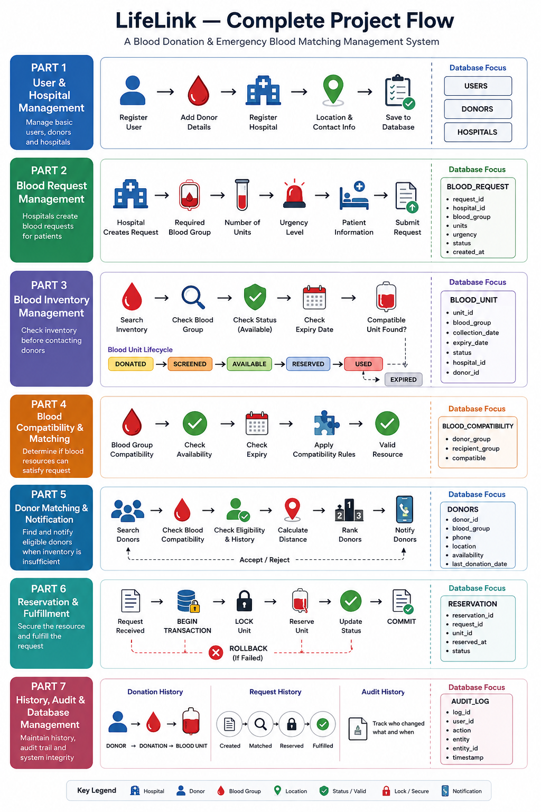
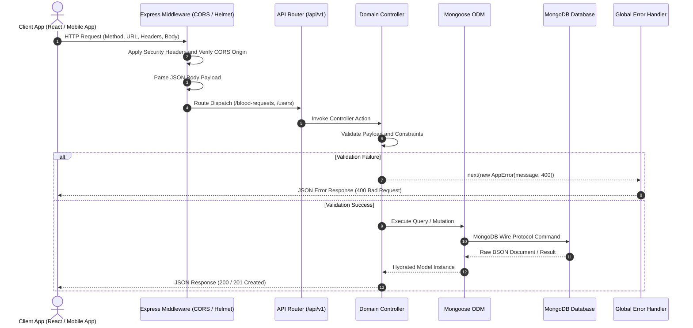
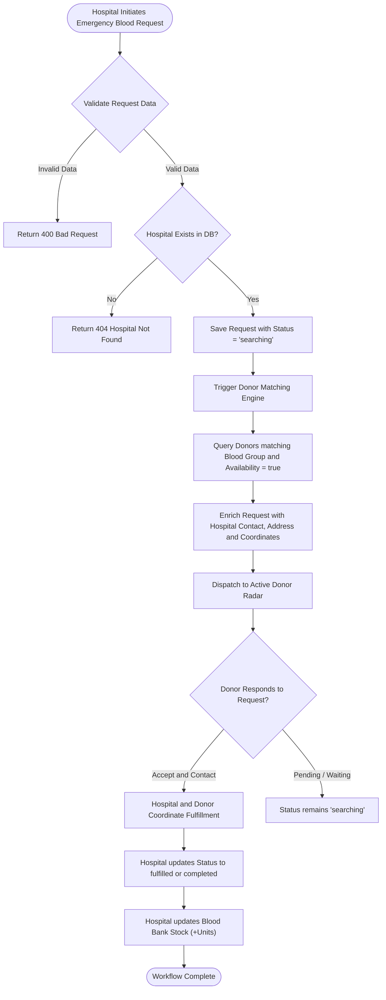
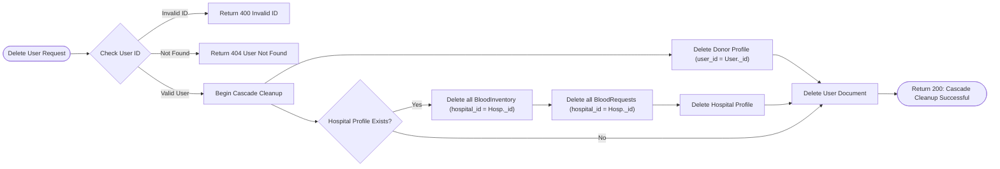
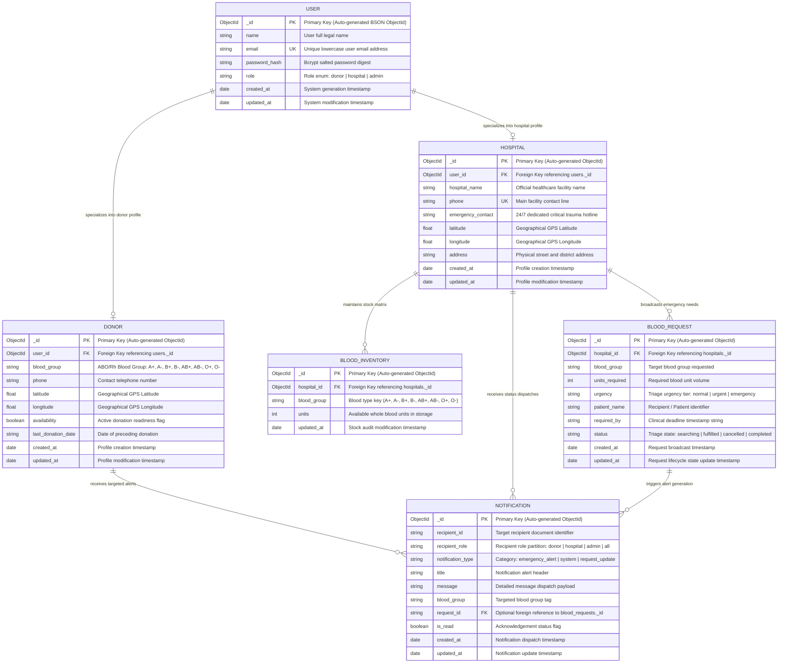
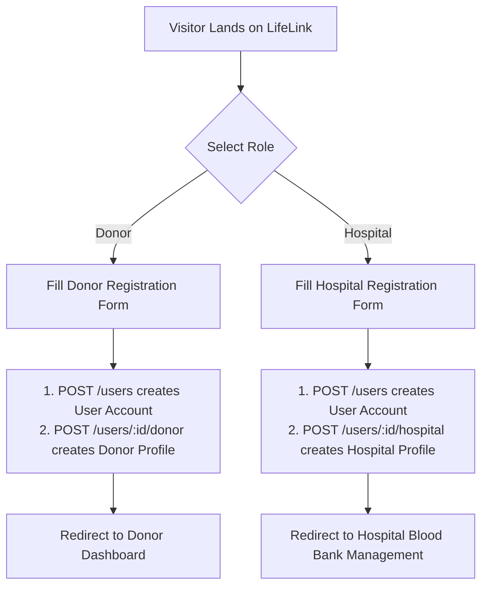
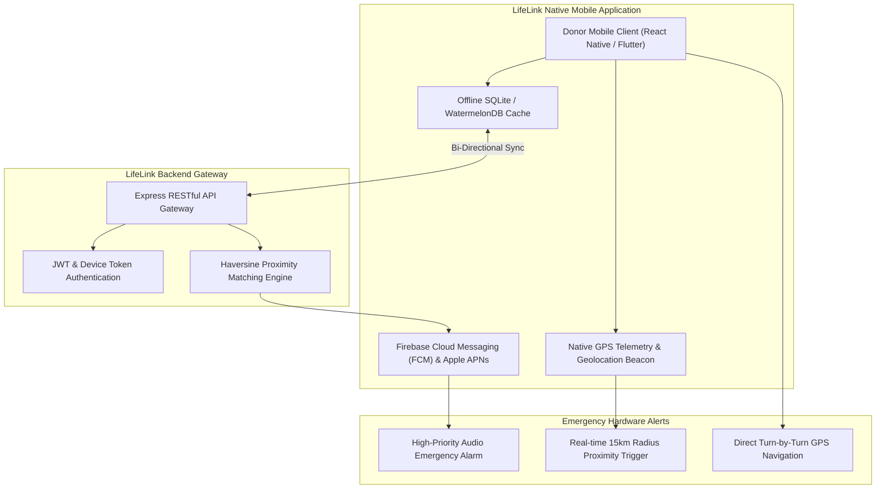

# LifeLink — Intelligent Blood Donation and Emergency Matching Platform

<p align="center">
  
</p>

<p align="center">
  
  
  
  
  
  
  
</p>

---

## Table of Contents

1. [Executive Overview](#executive-overview)
2. [Key Capabilities and Features](#key-capabilities-and-features)
3. [System Architecture](#system-architecture)
   - [High-Level 3-Tier Architecture](#high-level-3-tier-architecture)
   - [API Request and Middleware Pipeline](#api-request-and-middleware-pipeline)
   - [Emergency Blood Matching Flowchart](#emergency-blood-matching-flowchart)
   - [Referential Integrity and Cascade Deletion Lifecycle](#referential-integrity-and-cascade-deletion-lifecycle)
4. [Entity-Relationship (ER) Diagram](#entity-relationship-er-diagram)
5. [End-to-End Business Processes](#end-to-end-business-processes)
   - [1. User Onboarding and Role Segregation](#1-user-onboarding-and-role-segregation)
   - [2. Hospital Blood Bank Stock Management](#2-hospital-blood-bank-stock-management)
   - [3. Emergency Request Triage and Dispatch](#3-emergency-request-triage-and-dispatch)
   - [4. Donor Matching and Response Workflow](#4-donor-matching-and-response-workflow)
   - [5. Administrative Oversight and Moderation](#5-administrative-oversight-and-moderation)
6. [Complete RESTful API Specification](#complete-restful-api-specification)
7. [Database Schema and Indexing Strategy](#database-schema-and-indexing-strategy)
8. [Blood Compatibility Reference Matrix](#blood-compatibility-reference-matrix)
9. [Installation and Setup Guide](#installation-and-setup-guide)
   - [Prerequisites](#prerequisites)
   - [Backend Configuration and Execution](#backend-configuration-and-execution)
   - [Frontend Configuration and Execution](#frontend-configuration-and-execution)
10. [Project Directory Structure](#project-directory-structure)
11. [Future Scope: Native Mobile Application (Final Review)](#future-scope-native-mobile-application-final-review)
12. [License and Acknowledgments](#license-and-acknowledgments)

---

## Executive Overview

**LifeLink** is a mission-critical, full-stack healthcare platform engineered to bridge the critical time gap between emergency blood requirements and active volunteer donors. By connecting hospitals, registered blood donors, and medical administrators within a unified ecosystem, LifeLink accelerates blood discovery, tracks real-time hospital inventories across 8 blood groups, and matches urgent blood requests with compatible nearby donors.

### Core Value Pillars
- **Zero-Latency Emergency Triage**: Rapid creation and instant dispatch of urgent and emergency blood requests.
- **Automated Compatibility Matching**: Real-time aggregation of requests matching ABO/Rh blood groups and geolocation.
- **Comprehensive Hospital Blood Banks**: Live tracking of available blood units across all 8 major blood types.
- **Enterprise Data Integrity**: Automated cascade deletion, unique index enforcement, and sanitized RESTful interfaces.

---

## Key Capabilities and Features

| Capability | Description |
| :--- | :--- |
| **Multi-Role Authentication** | Tailored dashboards and access control for **Donors**, **Hospitals**, and **System Administrators**. |
| **Live Blood Bank Matrix** | 8-group matrix (`A+`, `A-`, `B+`, `B-`, `AB+`, `AB-`, `O+`, `O-`) with instant stock updates and threshold indicators. |
| **Emergency Broadcast Engine** | Hospitals broadcast critical blood requests with triage priorities (`normal`, `urgent`, `emergency`). |
| **Donor Smart Alerts** | Donors receive real-time visibility into compatible blood requests with hospital contact and GPS coordinates. |
| **Cascade Account Lifecycle** | Deleting a user account automatically cleans up linked profiles, inventory documents, and open requests. |
| **Admin Operations Hub** | Centralized console to audit, filter, monitor, and moderate users, donors, and hospital networks. |

---

## System Architecture

### High-Level 3-Tier Architecture

```mermaid
graph TB
    subgraph Client_Layer["Presentation Tier (Client Web App & Native Mobile App)"]
        UI_Landing["Landing Page & Hero Portal"]
        UI_Auth["Auth Portal (Login / Register Modals)"]
        UI_Donor["Donor Dashboard & Match Radar"]
        UI_Hospital["Hospital Dashboard & Blood Bank"]
        UI_Admin["Admin Oversight & Governance Center"]
        UI_Mobile["Cross-Platform Mobile App (iOS / Android)"]
    end

    subgraph Gateway_Layer["Security & API Gateway Layer (Express.js)"]
        MW_Helmet["Helmet Security Headers"]
        MW_CORS["CORS Protection"]
        MW_Parser["JSON & URL Parsers (10MB Limit)"]
        MW_ErrorHandler["Standardized Error Handler"]
    end

    subgraph Controller_Layer["Application Tier (Controllers & Services)"]
        Ctrl_Auth["Auth Controller (Login & Session)"]
        Ctrl_User["User Controller (Cascade Management)"]
        Ctrl_Donor["Donor Controller (Profile & Geolocation)"]
        Ctrl_Hospital["Hospital Controller (Profile & Directory)"]
        Ctrl_BloodBank["Blood Bank Controller (8-Group Matrix)"]
        Ctrl_Request["Blood Request Controller (Emergency Triage)"]
        Ctrl_Analytics["Analytics Controller (Platform Metrics)"]
    end

    subgraph Data_Layer["Data Tier (MongoDB & Mongoose ODM)"]
        Col_Users[("users Collection - Unique Email Index")]
        Col_Donors[("donors Collection - Compound Index")]
        Col_Hospitals[("hospitals Collection - Unique Phone Index")]
        Col_Inventory[("blood_inventory Collection - Compound Unique Index")]
        Col_Requests[("blood_requests Collection - Index [hospital_id, created_at]")]
        Col_Notifications[("notifications Collection - Index [recipient_id, created_at]")]
    end

    UI_Landing & UI_Auth & UI_Donor & UI_Hospital & UI_Admin & UI_Mobile -->|HTTP/REST| MW_Helmet
    MW_Helmet --> MW_CORS
    MW_CORS --> MW_Parser

    MW_Parser --> Ctrl_Auth & Ctrl_User & Ctrl_Donor & Ctrl_Hospital & Ctrl_BloodBank & Ctrl_Request & Ctrl_Analytics

    Ctrl_Auth --> Col_Users
    Ctrl_User --> Col_Users & Col_Donors & Col_Hospitals & Col_Inventory & Col_Requests
    Ctrl_Donor --> Col_Donors & Col_Users
    Ctrl_Hospital --> Col_Hospitals & Col_Users
    Ctrl_BloodBank --> Col_Inventory & Col_Hospitals
    Ctrl_Request --> Col_Requests & Col_Hospitals & Col_Donors
    Ctrl_Analytics --> Col_Users & Col_Donors & Col_Hospitals & Col_Inventory & Col_Requests

    Ctrl_Auth & Ctrl_User & Ctrl_Donor & Ctrl_Hospital & Ctrl_BloodBank & Ctrl_Request & Ctrl_Analytics -.->|On Error| MW_ErrorHandler
```



---

### API Request and Middleware Pipeline



---

### Emergency Blood Matching Flowchart



---

### Referential Integrity and Cascade Deletion Lifecycle



---

## Entity-Relationship (ER) Diagram and DBMS Foundations

The LifeLink system data model is engineered following formal Database Management System (DBMS) principles, combining relational structural integrity with high-concurrency document-store performance.

### Enhanced Crow's Foot Entity-Relationship Diagram



---

### DBMS Concepts & Theoretical Analysis

#### 1. Relational Schema Mapping & Mathematical Notation
In relational algebra, the LifeLink database structure is formalized into 6 normalized relations:

- `USER(user_id, name, email, password_hash, role, created_at, updated_at)`
- `DONOR(donor_id, user_id, blood_group, phone, latitude, longitude, availability, last_donation_date, created_at, updated_at)`
- `HOSPITAL(hospital_id, user_id, hospital_name, phone, emergency_contact, latitude, longitude, address, created_at, updated_at)`
- `BLOOD_INVENTORY(inventory_id, hospital_id, blood_group, units, updated_at)`
- `BLOOD_REQUEST(request_id, hospital_id, blood_group, units_required, urgency, patient_name, required_by, status, created_at, updated_at)`
- `NOTIFICATION(notification_id, recipient_id, recipient_role, notification_type, title, message, blood_group, request_id, is_read, created_at, updated_at)`

*Key constraints: Primary keys (PK) are unique non-null identifiers; Foreign keys (FK) link dependent relations.*

---

#### 2. Entity Specialization and Generalization (Inheritance Hierarchy)
LifeLink implements **Disjoint Class Table Inheritance (Subtype Modeling)**:
- **Supertype**: The `USER` entity encapsulates shared authentication attributes (`name`, `email`, `password_hash`, `role`).
- **Subtypes**:
  - `DONOR`: Extends `USER` with volunteer biological and spatial telemetry (`blood_group`, `phone`, `latitude`, `longitude`, `availability`).
  - `HOSPITAL`: Extends `USER` with medical enterprise infrastructure (`hospital_name`, `emergency_contact`, `address`, `latitude`, `longitude`).
- **Constraint Enforcement**: The `role` discriminator column strictly guarantees mutually exclusive subtype relationships:
  - Every User with `role = 'donor'` maps to exactly one record in `DONOR` where `DONOR.user_id = USER._id`.
  - Every User with `role = 'hospital'` maps to exactly one record in `HOSPITAL` where `HOSPITAL.user_id = USER._id`.

---

#### 3. Database Integrity Constraints Matrix

| Constraint Category | DBMS Principle | Mongoose & MongoDB Implementation | SQL Equivalent |
| :--- | :--- | :--- | :--- |
| **Entity Integrity** | Every relation must possess a non-null, immutable Primary Key. | `_id: { type: Schema.Types.ObjectId, auto: true }` | `id INT PRIMARY KEY AUTO_INCREMENT` |
| **Referential Integrity** | Foreign Keys must either match a valid PK in the referenced relation or be null. | `user_id: { type: Schema.Types.ObjectId, ref: 'User', required: true }` | `FOREIGN KEY (user_id) REFERENCES users(id) ON DELETE CASCADE` |
| **Domain Integrity** | Attributes must adhere strictly to defined data types, ranges, and enumerated sets. | `blood_group: { type: String, enum: ['A+', 'A-', 'B+', 'B-', 'AB+', 'AB-', 'O+', 'O-'] }` | `CHECK (blood_group IN ('A+', 'A-', 'B+', 'B-', 'AB+', 'AB-', 'O+', 'O-'))` |
| **User-Defined Integrity** | Compound business rules preventing state duplication. | `BloodInventorySchema.index({ hospital_id: 1, blood_group: 1 }, { unique: true })` | `CONSTRAINT unique_stock UNIQUE (hospital_id, blood_group)` |

---

#### 4. Normalization and De-normalization Trade-off Analysis

##### Normal Form Proofs:
1. **First Normal Form (1NF)**: All attributes contain strictly atomic, scalar values. No multi-valued repeating groups (e.g. the 8 blood types are normalized into discrete rows in `blood_inventory` rather than an unindexed array).
2. **Second Normal Form (2NF)**: All non-key attributes are fully functionally dependent on the complete primary key (`PK -> Attributes`). No partial dependencies exist.
3. **Third Normal Form (3NF)**: No transitive functional dependencies exist (`X -> Y` and `Y -> Z` where `X` is `PK`). For example, hospital address and phone are stored solely in `HOSPITAL`, not duplicated in `BLOOD_REQUEST`.
4. **Boyce-Codd Normal Form (BCNF)**: For every functional dependency `X -> Y`, `X` is a superkey.

##### Controlled De-normalization for Ultra-Low Latency Triage:
In mission-critical emergency scenarios where seconds save lives, join operations across distributed shards introduce I/O latency. To achieve sub-millisecond query execution:
- The donor matching endpoint (`GET /blood-requests/donor/:id`) utilizes index-covered `$lookup` joins in MongoDB, consolidating hospital contact and coordinates directly into the response payload in a single database round-trip (O(1) lookup time).

---

#### 5. ACID Transaction Management and Single-Document Atomicity

- **Atomicity (A)**: MongoDB guarantees single-document atomicity for all write and update operations. Stock modifications use atomic operators (`$set`, `$inc`) ensuring partial inventory updates never occur.
- **Consistency (C)**: Mongoose pre-save validation hooks and unique index constraints prevent invalid states from reaching the database storage engine (WiredTiger).
- **Isolation (I)**: Read-uncommitted and read-committed isolation levels prevent dirty reads during concurrent triage updates.
- **Durability (D)**: Write concerns (`w: 1` with write-ahead journal logging) guarantee committed transactions survive unexpected server restarts.

---

### Mongoose Code Implementation and DBMS Mapping

Below are the core schema models illustrating the direct application of DBMS concepts in the Node.js + Mongoose codebase:

#### 1. User Entity Schema ([backend/src/models/User.js](file:///e:/DBMS/backend/src/models/User.js))
```javascript
import mongoose from 'mongoose';

const UserSchema = new mongoose.Schema(
  {
    name: {
      type: String,
      required: [true, 'Name is required'],
      trim: true,
      maxlength: 100,
    },
    email: {
      type: String,
      required: [true, 'Email is required'],
      unique: true,
      lowercase: true,
      trim: true,
    },
    password_hash: {
      type: String,
      required: [true, 'Password hash is required'],
    },
    role: {
      type: String,
      required: [true, 'Role is required'],
      enum: ['donor', 'hospital', 'admin'],
      default: 'donor',
    },
  },
  {
    timestamps: { createdAt: 'created_at', updatedAt: 'updated_at' },
  }
);
```

#### 2. Blood Inventory Schema with Compound Unique Index ([backend/src/models/BloodInventory.js](file:///e:/DBMS/backend/src/models/BloodInventory.js))
```javascript
import mongoose from 'mongoose';

const BloodInventorySchema = new mongoose.Schema(
  {
    hospital_id: {
      type: mongoose.Schema.Types.ObjectId,
      ref: 'Hospital',
      required: [true, 'Hospital ID is required'],
    },
    blood_group: {
      type: String,
      required: [true, 'Blood group is required'],
      enum: ['A+', 'A-', 'B+', 'B-', 'AB+', 'AB-', 'O+', 'O-'],
    },
    units: {
      type: Number,
      required: true,
      default: 0,
      min: [0, 'Units cannot be negative'],
    },
  },
  {
    timestamps: { createdAt: false, updatedAt: 'updated_at' },
  }
);

BloodInventorySchema.index({ hospital_id: 1, blood_group: 1 }, { unique: true });
```

#### 3. Referential Cascade Deletion Execution ([backend/src/controllers/userController.js](file:///e:/DBMS/backend/src/controllers/userController.js))
```javascript
export const deleteUser = async (req, res, next) => {
  try {
    const { user_id } = req.params;
    const user = await User.findById(user_id);
    if (!user) return next(new AppError('User not found', 404));

    await Donor.deleteMany({ user_id });

    const hospital = await Hospital.findOne({ user_id });
    if (hospital) {
      await BloodInventory.deleteMany({ hospital_id: hospital._id });
      await BloodRequest.deleteMany({ hospital_id: hospital._id });
      await Hospital.findByIdAndDelete(hospital._id);
    }

    await User.findByIdAndDelete(user_id);

    res.status(200).json({
      message: 'User and all associated profile, inventory, and request records cascade deleted successfully',
    });
  } catch (error) {
    next(error);
  }
};
```

#### 4. Geospatial Proximity Matching & Haversine Calculation
LifeLink computes spatial proximity between donors and emergency trauma centers using the spherical Haversine trigonometric formula:

```text
d = 2R · atan2( √a, √(1−a) )
where a = sin²(Δϕ / 2) + cos(ϕ₁) · cos(ϕ₂) · sin²(Δλ / 2)
```

- `ϕ₁, ϕ₂`: Latitude coordinates of donor and hospital in radians.
- `λ₁, λ₂`: Longitude coordinates in radians.
- `R`: Earth mean radius (6,371 km).

```javascript
export function calculateHaversineDistance(lat1, lon1, lat2, lon2) {
  const R = 6371;
  const dLat = ((lat2 - lat1) * Math.PI) / 180;
  const dLon = ((lon2 - lon1) * Math.PI) / 180;
  const a =
    Math.sin(dLat / 2) * Math.sin(dLat / 2) +
    Math.cos((lat1 * Math.PI) / 180) * Math.cos((lat2 * Math.PI) / 180) * Math.sin(dLon / 2) * Math.sin(dLon / 2);
  const c = 2 * Math.atan2(Math.sqrt(a), Math.sqrt(1 - a));
  return Number((R * c).toFixed(1));
}
```

---

### Comprehensive Database Query Catalog (DBMS Operations & Mathematical Formalization)

Below is the exhaustive mathematical and practical breakdown of every query executed within the LifeLink platform, contrasting formal Relational Algebra, ANSI SQL:1999, MongoDB Mongoose ODM queries, and internal storage engine execution plans:

#### Query 1: User Identity Authentication & Single-Record Selection
- **Relational Algebra**:
  `σ[email = target_email](USER)`
- **Standard ANSI SQL**:
  ```sql
  SELECT user_id, name, email, password_hash, role
  FROM users
  WHERE email = 'donor@lifelink.org'
  LIMIT 1;
  ```
- **MongoDB Mongoose Query**:
  ```javascript
  const user = await User.findOne({ email: email.toLowerCase() });
  ```
- **Storage Engine Execution Plan**: `IXSCAN` on `{ email: 1 }` Unique B-Tree Index. Time Complexity: `O(log N)`. Zero collection scans (`COLLSCAN: 0`).

---

#### Query 2: Active Donor Discovery for Emergency Broadcast
- **Relational Algebra**:
  `π[donor_id, phone, latitude, longitude, availability]( σ[blood_group = 'O-' ∧ availability = true](DONOR) )`
- **Standard ANSI SQL**:
  ```sql
  SELECT id, phone, latitude, longitude, availability
  FROM donors
  WHERE blood_group = 'O-' AND availability = TRUE;
  ```
- **MongoDB Mongoose Query**:
  ```javascript
  const donors = await Donor.find({ blood_group: 'O-', availability: true });
  ```
- **Storage Engine Execution Plan**: `IXSCAN` utilizing the Compound Index `{ blood_group: 1, availability: 1 }`. Filtering occurs at index-level prior to document fetching.

---

#### Query 3: Emergency Transfusion Request Join with Healthcare Facility Contact
- **Relational Algebra**:
  `π[r.id, r.blood_group, r.units_required, r.urgency, h.hospital_name, h.phone, h.address, h.latitude, h.longitude]( σ[r.blood_group = 'O-' ∧ r.status = 'searching'](BLOOD_REQUEST r) ⨝[r.hospital_id = h._id] HOSPITAL h )`
- **Standard ANSI SQL**:
  ```sql
  SELECT 
    r.id AS request_id,
    r.blood_group,
    r.units_required,
    r.urgency,
    r.status,
    h.hospital_name,
    h.phone AS hospital_phone,
    h.emergency_contact,
    h.address AS hospital_address,
    h.latitude AS hospital_latitude,
    h.longitude AS hospital_longitude
  FROM blood_requests r
  INNER JOIN hospitals h ON r.hospital_id = h.id
  WHERE r.blood_group = 'O-' AND r.status = 'searching'
  ORDER BY r.created_at DESC;
  ```
- **MongoDB Mongoose Query**:
  ```javascript
  const requests = await BloodRequest.find({ blood_group: 'O-', status: 'searching' })
    .populate('hospital_id')
    .sort({ created_at: -1 });
  ```
- **Storage Engine Execution Plan**: `IXSCAN` on `{ blood_group: 1, status: 1 }` followed by indexed primary key lookups against `hospitals._id`.

---

#### Query 4: 8-Group Refrigeration Stock Imputation & Fetch
- **Relational Algebra**:
  `π[blood_group, units]( σ[hospital_id = target_id](BLOOD_INVENTORY) )`
- **Standard ANSI SQL**:
  ```sql
  SELECT blood_group, units
  FROM blood_inventory
  WHERE hospital_id = '65d1f89e2c4a1b0012e4f5a1';
  ```
- **MongoDB Mongoose Query**:
  ```javascript
  const stock = await BloodInventory.find({ hospital_id: targetId });
  ```
- **Storage Engine Execution Plan**: `IXSCAN` on compound unique index `{ hospital_id: 1, blood_group: 1 }` prefix `{ hospital_id: 1 }`. Guarantees retrieval of 8 records in `O(log N)` time.

---

#### Query 5: Atomic Inventory Modification (Compare-and-Swap / Upsert)
- **Relational Algebra**:
  `UPSERT(BLOOD_INVENTORY, hospital_id = h ∧ blood_group = g, units ← u)`
- **Standard ANSI SQL**:
  ```sql
  INSERT INTO blood_inventory (hospital_id, blood_group, units, updated_at)
  VALUES ('65d1f89e2c4a1b0012e4f5a1', 'O+', 12, NOW())
  ON CONFLICT (hospital_id, blood_group)
  DO UPDATE SET units = EXCLUDED.units, updated_at = NOW();
  ```
- **MongoDB Mongoose Query**:
  ```javascript
  const item = await BloodInventory.findOneAndUpdate(
    { hospital_id, blood_group },
    { $set: { units } },
    { new: true, upsert: true, runValidators: true }
  );
  ```
- **Storage Engine Execution Plan**: Unique Index seek on `{ hospital_id: 1, blood_group: 1 }`. If matched, applies single-document in-place mutation. If unindexed, generates a new document atomically without table locks.

---

#### Query 6: Aggregate Platform Blood Reserves Rollup
- **Relational Algebra**:
  `γ[blood_group, SUM(units) → total_units](BLOOD_INVENTORY)`
- **Standard ANSI SQL**:
  ```sql
  SELECT blood_group, COALESCE(SUM(units), 0) AS total_units
  FROM blood_inventory
  GROUP BY blood_group;
  ```
- **MongoDB Mongoose Query**:
  ```javascript
  const stats = await BloodInventory.aggregate([
    {
      $group: {
        _id: '$blood_group',
        total_units: { $sum: '$units' },
      },
    },
  ]);
  ```
- **Storage Engine Execution Plan**: Document pipeline engine executing an in-memory hash aggregation across the 8 distinct blood group buckets.

---

#### Query 7: Topological Referential Cascade Deletion
- **Relational Algebra**:
  `DELETE FROM USER WHERE user_id = u ⟹ CASCADE DELETE (DONOR, HOSPITAL → (BLOOD_INVENTORY, BLOOD_REQUEST))`
- **Standard ANSI SQL**:
  ```sql
  DELETE FROM users WHERE id = '65d1f89e2c4a1b0012e4f5a1';
  -- Cascade foreign keys automatically purge dependent rows:
  -- FOREIGN KEY (user_id) REFERENCES users(id) ON DELETE CASCADE
  ```
- **MongoDB Mongoose Query**:
  ```javascript
  await Donor.deleteMany({ user_id });
  const hospital = await Hospital.findOne({ user_id });
  if (hospital) {
    await BloodInventory.deleteMany({ hospital_id: hospital._id });
    await BloodRequest.deleteMany({ hospital_id: hospital._id });
    await Hospital.findByIdAndDelete(hospital._id);
  }
  await User.findByIdAndDelete(user_id);
  ```

---

#### Query 8: Triage Request Status Transition
- **Relational Algebra**:
  `UPDATE BLOOD_REQUEST SET status = 'fulfilled', updated_at = NOW() WHERE request_id = r`
- **Standard ANSI SQL**:
  ```sql
  UPDATE blood_requests
  SET status = 'fulfilled', updated_at = NOW()
  WHERE id = '65d1f89e2c4a1b0012e4f5a9';
  ```
- **MongoDB Mongoose Query**:
  ```javascript
  const req = await BloodRequest.findByIdAndUpdate(
    request_id,
    { status: 'fulfilled' },
    { new: true }
  );
  ```

---

#### Query 9: User Directory Multi-Attribute Pagination & Search
- **Relational Algebra**:
  `π[user_id, name, email, role, created_at]( σ[role = 'donor'](USER) )`
- **Standard ANSI SQL**:
  ```sql
  SELECT id, name, email, role, created_at
  FROM users
  WHERE role = 'donor'
  ORDER BY created_at DESC
  LIMIT 50 OFFSET 0;
  ```
- **MongoDB Mongoose Query**:
  ```javascript
  const users = await User.find({ role: 'donor' })
    .select('-password_hash')
    .sort({ created_at: -1 })
    .limit(50);
  ```

---

## End-to-End Business Processes

### 1. User Onboarding and Role Segregation


### 2. Hospital Blood Bank Stock Management
1. **Matrix Initialization**: Hospitals query `GET /hospitals/:id/blood-bank`. The backend guarantees an 8-slot response representing `A+`, `A-`, `B+`, `B-`, `AB+`, `AB-`, `O+`, `O-` (with `0` units if not yet explicitly stocked).
2. **Stock Increment/Decrement**: Hospital managers edit units for specific blood types via `PUT /hospitals/:id/blood-bank`.
3. **Upsert Logic**: MongoDB automatically updates the record or creates a new entry using the compound unique index `{ hospital_id: 1, blood_group: 1 }`.

### 3. Emergency Request Triage and Dispatch
1. **Urgency Classification**:
   - `normal`: Standard elective transfusion or scheduled surgery preparation.
   - `urgent`: Timed requirement needed within 12-24 hours.
   - `emergency`: Immediate trauma or ICU life-support requirement.
2. **Broadcast Trigger**: Sending a `POST /blood-requests` immediately marks the request as `searching` and makes it discoverable by matching donors.

### 4. Donor Matching and Response Workflow
1. **Radar Discovery**: When a donor logs into their dashboard, the system calls `GET /blood-requests/donor/:donor_id`.
2. **Compatibility Query**: The backend queries all active requests matching the donor's blood group and joins hospital contact information (`hospital_name`, `hospital_phone`, `emergency_contact`, `hospital_address`, and coordinates).
3. **Direct Contact**: Donors can view the distance, open hospital navigation coordinates, or call the 24/7 hotline directly.

### 5. Administrative Oversight and Moderation
1. **Global Visibility**: Administrators have full access to view, search, and filter all registered users, active donors, verified hospitals, and platform analytics.
2. **Auditing and Moderation**: In case of duplicate profiles, deactivated medical centers, or fraudulent entries, administrators can execute deletions with automatic cascade cleanup.

---

## Complete RESTful API Specification

Base URL: `http://127.0.0.1:8000` (or `/api/v1`)

### Authentication and Session
| Method | Endpoint | Description | Request Payload | Response Status |
| :--- | :--- | :--- | :--- | :--- |
| `POST` | `/login` | Authenticate user with email and password | `{ "email": "...", "password": "..." }` | `200 OK` / `401 Unauthorized` |
| `GET` | `/` | System health check and API version info | _None_ | `200 OK` |

### User Management
| Method | Endpoint | Description | Request Payload | Response Status |
| :--- | :--- | :--- | :--- | :--- |
| `POST` | `/users` | Create base user record | `{ "name": "...", "email": "...", "password_hash": "...", "role": "donor\|hospital" }` | `200 OK` / `400 Bad Request` |
| `GET` | `/users` | Retrieve all registered users (excluding password) | _None_ | `200 OK` |
| `GET` | `/users/:user_id` | Retrieve single user profile by ID | _None_ | `200 OK` / `404 Not Found` |
| `DELETE` | `/users/:user_id` | **Cascade delete** user, profile, inventory, and requests | _None_ | `200 OK` / `404 Not Found` |

### Donor Management
| Method | Endpoint | Description | Request Payload | Response Status |
| :--- | :--- | :--- | :--- | :--- |
| `POST` | `/users/:user_id/donor` | Attach donor profile to existing user | `{ "blood_group": "O+", "phone": "...", "latitude": 40.71, "longitude": -74.00, "availability": true }` | `200 OK` / `400 Bad Request` |
| `GET` | `/donors` | Retrieve all donor profiles | _None_ | `200 OK` |
| `GET` | `/donors/:donor_id` | Retrieve single donor profile | _None_ | `200 OK` / `404 Not Found` |
| `PUT` | `/donors/:donor_id` | Update donor availability, phone, or location | `{ "availability": false, "last_donation_date": "2026-08-20" }` | `200 OK` / `404 Not Found` |
| `DELETE` | `/donors/:donor_id` | Delete donor profile | _None_ | `200 OK` / `404 Not Found` |

### Hospital Management and Blood Bank
| Method | Endpoint | Description | Request Payload | Response Status |
| :--- | :--- | :--- | :--- | :--- |
| `POST` | `/users/:user_id/hospital` | Attach hospital profile to existing user | `{ "hospital_name": "...", "phone": "...", "emergency_contact": "...", "latitude": 40.71, "longitude": -74.00, "address": "..." }` | `200 OK` / `400 Bad Request` |
| `GET` | `/hospitals` | Retrieve all registered hospitals | _None_ | `200 OK` |
| `GET` | `/hospitals/:hospital_id` | Retrieve single hospital details | _None_ | `200 OK` / `404 Not Found` |
| `PUT` | `/hospitals/:hospital_id` | Update hospital contact information or address | `{ "emergency_contact": "+1-555-0911" }` | `200 OK` / `404 Not Found` |
| `DELETE` | `/hospitals/:hospital_id` | Cascade delete hospital, inventory, and requests | _None_ | `200 OK` / `404 Not Found` |
| `GET` | `/hospitals/:hospital_id/blood-bank` | Retrieve 8-group stock matrix for hospital | _None_ | `200 OK` |
| `PUT` | `/hospitals/:hospital_id/blood-bank` | Upsert blood stock units for a blood group | `{ "blood_group": "A+", "units": 15 }` | `200 OK` / `400 Bad Request` |

### Blood Requests and Emergency Matching
| Method | Endpoint | Description | Request Payload | Response Status |
| :--- | :--- | :--- | :--- | :--- |
| `POST` | `/blood-requests` | Broadcast new blood request | `{ "hospital_id": "...", "blood_group": "O-", "units_required": 3, "urgency": "emergency", "patient_name": "...", "required_by": "..." }` | `200 OK` / `400 Bad Request` |
| `GET` | `/blood-requests/hospital/:hospital_id` | List all requests issued by a hospital | _None_ | `200 OK` |
| `GET` | `/blood-requests/donor/:donor_id` | **Smart Match**: List requests matching donor's blood type enriched with hospital details | _None_ | `200 OK` |
| `GET` | `/blood-requests/:request_id` | Retrieve single blood request | _None_ | `200 OK` / `404 Not Found` |
| `PUT` | `/blood-requests/:request_id` | Update request status, units, or urgency | `{ "status": "fulfilled" }` | `200 OK` / `400 Bad Request` |
| `DELETE` | `/blood-requests/:request_id` | Delete blood request | _None_ | `200 OK` / `404 Not Found` |

### System Analytics
| Method | Endpoint | Description | Response Status |
| :--- | :--- | :--- | :--- |
| `GET` | `/analytics/stats` | Platform totals (users, donors, hospitals, requests, stock by group) | `200 OK` |

---

## Database Schema and Indexing Strategy

To guarantee millisecond latency under high concurrency, MongoDB indexes are defined as follows:

| Collection | Index Key | Type / Constraint | Rationale |
| :--- | :--- | :--- | :--- |
| `users` | `{ email: 1 }` | Unique Index | Enforces unique email constraint and speeds up login lookups. |
| `donors` | `{ user_id: 1 }` | Unique Index | 1:1 relation constraint between User and Donor profile. |
| `donors` | `{ blood_group: 1, availability: 1 }` | Compound Index | Optimizes emergency donor discovery query. |
| `hospitals` | `{ user_id: 1 }` | Unique Index | 1:1 relation constraint between User and Hospital profile. |
| `hospitals` | `{ phone: 1 }` | Unique Index | Prevents duplicate hospital contact registrations. |
| `blood_inventory` | `{ hospital_id: 1, blood_group: 1 }` | Unique Compound | Ensures exactly 1 inventory record per blood type per hospital. |
| `blood_requests` | `{ hospital_id: 1, created_at: -1 }` | Compound Index | Speeds up hospital dashboard request history sorting. |
| `blood_requests` | `{ blood_group: 1, status: 1 }` | Compound Index | High-speed matching for donor radar. |

---

## Blood Compatibility Reference Matrix

| Recipient Blood Group | Compatible Donor Blood Groups (Can Receive From) | Can Donate To |
| :--- | :--- | :--- |
| **O-** *(Universal Red Cell Donor)* | `O-` | `O-`, `O+`, `A-`, `A+`, `B-`, `B+`, `AB-`, `AB+` (All) |
| **O+** | `O-`, `O+` | `O+`, `A+`, `B+`, `AB+` |
| **A-** | `O-`, `A-` | `A-`, `A+`, `AB-`, `AB+` |
| **A+** | `O-`, `O+`, `A-`, `A+` | `A+`, `AB+` |
| **B-** | `O-`, `B-` | `B-`, `B+`, `AB-`, `AB+` |
| **B+** | `O-`, `O+`, `B-`, `B+` | `B+`, `AB+` |
| **AB-** | `O-`, `A-`, `B-`, `AB-` | `AB-`, `AB+` |
| **AB+** *(Universal Recipient)* | `O-`, `O+`, `A-`, `A+`, `B-`, `B+`, `AB-`, `AB+` (All) | `AB+` |

---

## Installation and Setup Guide

### Prerequisites
- **Node.js**: Version `18.x` or `20.x+`
- **MongoDB**: Local MongoDB instance (`mongodb://127.0.0.1:27017`) or **MongoDB Atlas** connection URI.

---

### Backend Configuration and Execution

1. Navigate to the `backend` directory:
   ```bash
   cd backend
   ```

2. Install dependencies:
   ```bash
   npm install
   ```

3. Create/Configure your `.env` file:
   ```env
   PORT=8000
   NODE_ENV=development
   MONGODB_URL=mongodb://127.0.0.1:27017/lifelink
   CLIENT_URL=http://localhost:5173
   ```

4. Start the backend server:
   ```bash
   # Development with auto-reload:
   npm run dev

   # Production mode:
   npm start
   ```
   *The backend will be live at `http://127.0.0.1:8000/`.*

---

### Frontend Configuration and Execution

1. Open a separate terminal and navigate to the `frontend` directory:
   ```bash
   cd frontend
   ```

2. Install frontend dependencies:
   ```bash
   npm install
   ```

3. Start the Vite development server:
   ```bash
   npm run dev
   ```
   *The frontend will launch at `http://localhost:5173/`.*

---

## Project Directory Structure

```
DBMS/
├── package.json                  # Root orchestration and convenience scripts
├── README.md                     # Architecture, ER diagrams, and project documentation
│
├── backend/                      # Node.js + MongoDB RESTful API
│   ├── package.json              # Express, Mongoose, Helmet, Cors
│   ├── server.js                 # Server entry point & graceful shutdown
│   ├── .env.example              # Environment variables template
│   ├── .env                      # Local environment configuration
│   └── src/
│       ├── app.js                # Express app initialization & middleware stack
│       ├── config/
│       │   ├── db.js             # Mongoose connection & lifecycle events
│       │   └── env.js            # Environment validation & configuration
│       ├── models/
│       │   ├── User.js           # User schema & JSON transformer
│       │   ├── Donor.js          # Donor profile & geolocation schema
│       │   ├── Hospital.js       # Hospital schema & contact definitions
│       │   ├── BloodInventory.js # 8-group stock schema with compound uniqueness
│       │   ├── BloodRequest.js   # Emergency blood request & triage schema
│       │   └── Notification.js   # Notification logs
│       ├── controllers/
│       │   ├── authController.js         # Login & auth validation
│       │   ├── userController.js         # User CRUD & cascade deletion
│       │   ├── donorController.js        # Donor profiles & matching queries
│       │   ├── hospitalController.js     # Hospital records & directory
│       │   ├── bloodBankController.js    # 8-group matrix generation & upsert
│       │   ├── bloodRequestController.js # Triage request creation & smart match
│       │   └── analyticsController.js    # Aggregated platform statistics
│       ├── routes/
│       │   ├── authRoutes.js             # /login
│       │   ├── userRoutes.js             # /users
│       │   ├── donorRoutes.js            # /donors
│       │   ├── hospitalRoutes.js         # /hospitals
│       │   ├── bloodRequestRoutes.js     # /blood-requests
│       │   ├── analyticsRoutes.js        # /analytics
│       │   └── index.js                  # Route aggregator
│       └── middlewares/
│           └── errorMiddleware.js        # Global error & CastError transformer
│
└── frontend/                     # Modern React + Vite + TypeScript Client
    ├── package.json              # Dependencies (React, Lucide, Framer Motion, Tailwind)
    ├── vite.config.ts            # Vite build configuration
    ├── tailwind.config.js        # Design tokens & responsive theme
    ├── index.html                # Single-page application template
    └── src/
        ├── App.tsx               # Client routes & layout hierarchy
        ├── main.tsx              # React DOM root
        ├── index.css             # Global Tailwind directives & custom CSS
        ├── lib/                  # Centralized API client & session helpers
        ├── context/              # Toast & AuthModal context providers
        ├── components/           # Reusable UI component atoms & modules
        │   ├── ui/               # Card, Badge, StatCard, EmptyState
        │   ├── common/           # Navbar, Footer, PageHeader, MobileAppBanner
        │   ├── auth/             # LoginModal, RegisterModal (Modal-driven authentication)
        │   ├── donor/            # DonorRequestCard, AvailabilityToggle
        │   ├── hospital/         # BloodMatrixGrid, CreateRequestModal
        │   └── admin/            # DataTable
        ├── pages/                # Domain-structured application views
        │   ├── index.ts          # Barrel export aggregator
        │   ├── public/           # LandingPage, NotFoundPage
        │   ├── donor/            # DonorDashboard, MatchRadar, Profile, History, Notifications, Settings
        │   ├── hospital/         # HospitalDashboard, BloodBankStock, BloodRequests
        │   └── admin/            # AdminLogin, AdminDashboard, AdminManagement
        └── types/                # TypeScript interface definitions
```

---

## Future Scope: Native Mobile Application (Final Review)

For the final review and strategic roadmap, the core future development is the **Cross-Platform Native Mobile Application (iOS & Android)** engineered to empower on-the-go volunteer donors and emergency medical responders.



### Core Mobile Application Capabilities

#### 1. Cross-Platform Native Experience
- **Framework**: Built with **React Native / Flutter** for 60fps fluid animations, low battery consumption, and universal compatibility across iOS and Android devices.
- **Biometric Security**: TouchID / FaceID biometric authentication for instantaneous emergency profile access without password entry friction.

#### 2. Emergency Push Beacon System
- **Critical Audio Chime**: High-priority alert channel bypassing Silent / Do Not Disturb modes on mobile OS for critical trauma (`emergency`) broadcasts.
- **One-Tap Availability Confirmation**: Donors can accept or snooze emergency transfusion calls directly from interactive push notification banners without unlocking their phone.

#### 3. Real-Time Background Geolocation & Proximity Tracking
- **Adaptive Geofencing**: Automatically detects when registered volunteer donors move within a 5km to 15km radius of an emergency hospital with an active matching blood request.
- **Turn-by-Turn GPS Guidance**: Deep-links directly to Google Maps / Apple Maps for optimal emergency transit routing to the target hospital blood bank.

#### 4. Offline-First Synchronization Engine
- **Local SQLite / WatermelonDB Cache**: Allows donors to view their digital blood donor card, past donation history certificates, and blood compatibility charts even in zero-connectivity environments.
- **Background Sync**: Synchronizes locally logged health eligibility metrics and donation logs immediately when connectivity is restored.

---

## License and Acknowledgments

This project is licensed under the **MIT License**.